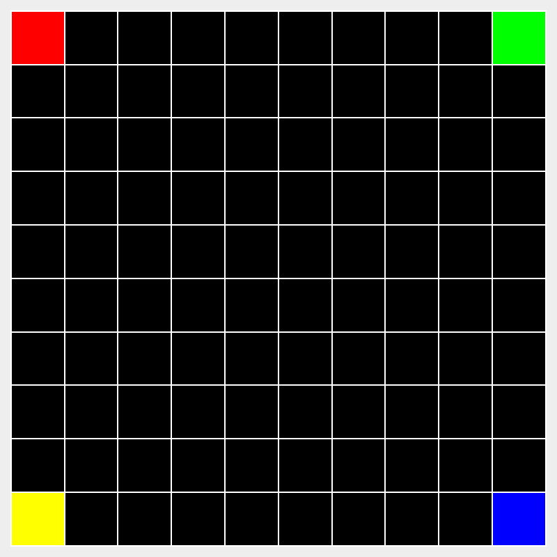
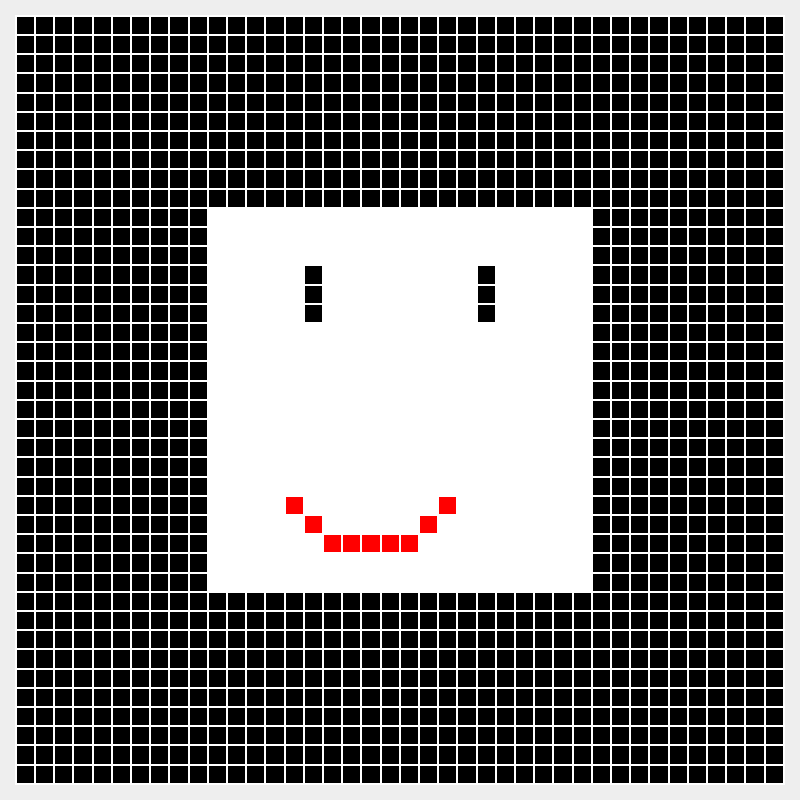

# **Steg 2 – Implementering av `GridView`**  

I denne oppgaven skal du lage en visuell fremstilling av gridet ved å implementere **`GridView`**. Dette gjøres ved å bruke **Java Swing**, der gridet tegnes ved hjelp av **Graphics2D**.  

✅ **Målet er å vise gridet i et vindu, hvor hver celle har en bestemt farge basert på innholdet.**  

[](./pics/example_grid.png)

### For de følgende stegene vil du kunne finne mye nyttig kode i [notatene om grafikk](https://inf101v23.stromme.me/notat/grafikk/) 

---

## **1️⃣ Opprett `GridView`-klassen**  

Opprett en ny klasse **`GridView`** i pakken **`no.uib.inf101.view`**.  
Denne klassen skal utvide **`JPanel`**, som lar oss tegne gridet i et Swing-vindu.  
```java
public class GridView extends JPanel {
    ...
}
```

---

## **2️⃣ Legg til nødvendige feltvariabler**  

For å tegne gridet må `GridView` inneholde følgende:  
- **En referanse til `IGrid`** – Representerer gridet som skal tegnes.  
- **En `ColorTheme`-instans** – Brukes for å bestemme fargene på cellene.  
- **Konstanter for ytre (`OUTERMARGIN`) og indre (`INNERMARGIN`) marginer** – Styrer spacing mellom cellene.

**For denne metoden trenger vi å opprette og implementere `ColorTheme`. [Følg denne guiden](./guide/colorTheme.md).**

🔹 **Pseudokode:**  
```
Definer OUTERMARGIN og INNERMARGIN som faste verdier.
Opprett en variabel for IGrid som skal inneholde gridet.
Opprett en instans av ColorTheme for å hente farger.
```

---

## **3️⃣ Lag en konstruktør**  

Konstruktøren skal:  
- Ta inn et `IGrid`-objekt og lagre det som en instansvariabel.  
- Opprette en `ColorTheme`-instans.  
- Angi vindusstørrelse  

🔹 **Javakode:**  
```java
public GridView(...) {
    ...

    this.setPreferredSize(new Dimension(..., ...));
}
```

---

## **4️⃣ Overstyr `paintComponent` for å tegne**  

`paintComponent(Graphics g)` kalles automatisk når Swing-vinduet tegnes.  
Her skal vi bruke **Graphics2D** for å tegne gridet.  

🔹 **Javakode:**  
```java
@Override
public void paintComponent(Graphics g) {
    super.paintComponent(g);
    Graphics2D g2 = (Graphics2D) g;
    drawGrid(g2);
}
```

---

## **5️⃣ Implementer `drawGrid` for å tegne bakgrunn og grid**  

`drawGrid` skal:  
- Tegne et rektangel som bakgrunn for gridet.  
- Opprette et **`CellPositionToPixelConverter`**-objekt som hjelper med plassering av cellene.  
- Kalle **`drawCells`** for å tegne selve cellene.  

**For denne metoden trenger vi å opprette og implementere `CellPositionToPixelConverter`. [Følg denne guiden](./guide/converter.md).**

🔹 **Pseudokode:**  
```
Metode drawGrid(g2):
    Lag et rektangel som dekker hele grid-området
    Fyll rektangelet med en bakgrunnsfarge
    Opprett CellPositionToPixelConverter med grid-dimensjoner og margin
    Kall drawCells(g2, converter, grid) for å tegne cellene
```
**Igjen, her vil du kunne finne mye nyttig kode i [notatene om grafikk](https://inf101v23.stromme.me/notat/grafikk/).**

---

## **6️⃣ Implementer `drawCells` for å tegne individuelle celler**  

`drawCells` skal:  
- Iterere gjennom alle `GridCell`-objektene i gridet.  
- Finne riktig plassering for hver celle ved hjelp av **`CellPositionToPixelConverter`**.  
- Hente riktig farge fra **`ColorTheme`** basert på cellens symbol.  
- Tegne cellene som rektangler med riktig farge.  

🔹 **Pseudokode:**  
```
Metode drawCells(g2, converter, grid):
    For hver celle i gridet:
        Hent posisjonen til cellen
        Finn cellens rektangulære område med converter
        Hent riktig farge fra ColorTheme basert på cellens symbol
        Tegn et fylt rektangel med den riktige fargen
```

---

## **7️⃣ Kjør programmet i `Main`**  

For å teste at `GridView` fungerer må vi:  
- Opprette et **`Grid`**-objekt med noen testverdier. `defaultValue` burde være `'-'`.
- Lage en **`GridView`** og sette den inn i et **`JFrame`**.  
- Vise vinduet på skjermen.  

```java
public static void main(String[] args) {
    GridView view = ...

    JFrame frame = new JFrame(WINDOW_TITLE);
    frame.setDefaultCloseOperation(JFrame.EXIT_ON_CLOSE);
    frame.setContentPane(view);
    frame.pack();
    frame.setVisible(true);
    
    ViewPrinter.savePanelAsImage(view, "grid.png");
}
```

## **8️⃣ Fyll inn gridet** 
Bruk `IGrid::set` til å fylle inn noe fargerikt for Sondre å se på når han retter labben :) Her må du minst legge til 4 celler, men du kan gjøre mye mer!

[](./pics/grid.png)

Gridet må printes til en png-fil. Sørg for at denne linjen ligger på slutten av `Main::main`: 
```java
ViewPrinter.savePanelAsImage(view, "grid.png");
```

---

## ✅ Retting av labben 
Denne labben blir rettet basert på testene i steg 1 og en manuell sjekk av `grid.png`. Hvis den inneholder et grid med noen fargeceller så får du godkjent :)

# Gjør deg klar til lab5
I lab5 skal vi bruke *Maven*. Gå til neste steg for installasjonsinstruks.

🔙 [Forrige steg](./01-grid.md) | 🔜 [Neste steg](./maven.md)  

